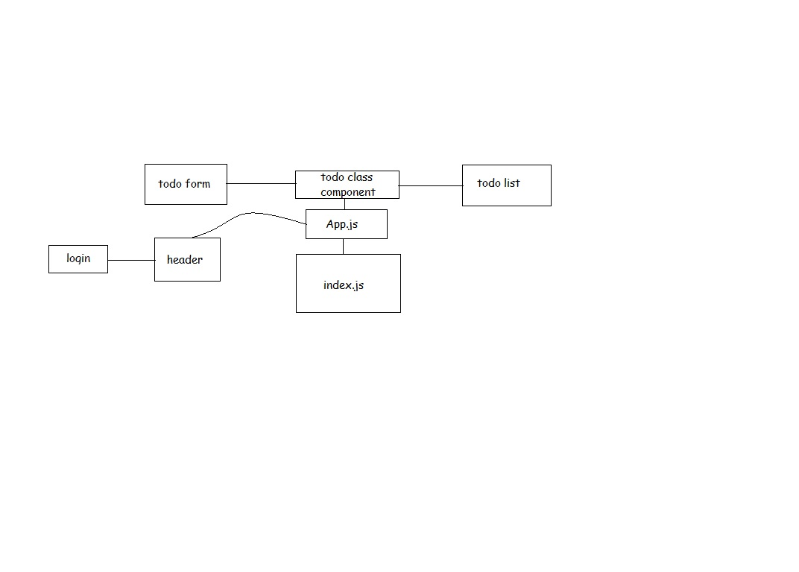

# todo
[app link](https://mytodoreact.netlify.app/)

```
to access the app feature you can use
- username: admin
- password: admin
```

- it is an app to follow the tasks with ability to login, built using the context and hooks using react.
contains functional components
- styled using the scss and react bootstrap
- the users with use the app depending on their roles
- react routes were used to link the pages and make the app as a single page and has best performance
> refactor the application using Hooks and upgrading the style.


